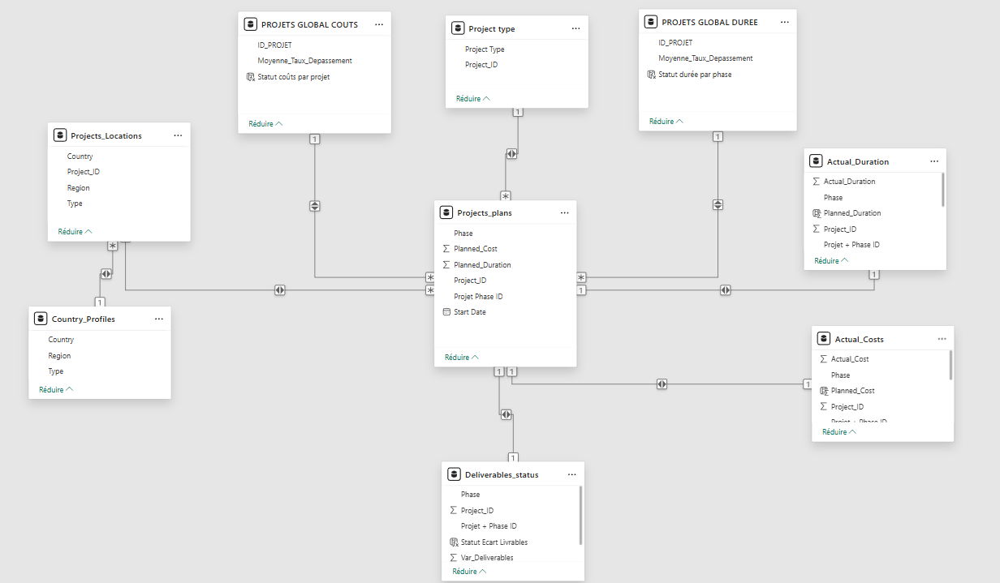

# 🧭 Méthodologie de préparation des données – Power Query & DAX

## 📂 Table `Projects_plans`

### 🛠️ Préparation dans Power Query

- 📌 **Promotion d’en-tête** → première ligne en en-tête.

- 🗑️ **Nettoyage** → suppression des lignes vides.

- 🔄 **Transformation de types :**

  - `Project_ID` → Nombre entier (meilleur affichage dans un segment de filtrage)

  - `Phase` → Texte
 
  - `Planned_Cost` → Nombre Décimal
 
  - `Start Date` → Date
 
  - Planned_Duration → Durée 

- 🔑 **Création d’une clé primaire :**

   - Duplication des colonnes `Project_ID` et `Phase`.
  
   - Fusion pour créer `Projet + Phase ID` au format Texte.
 
---

### 🧩 Liaison au modèle 

- 🔗 **Relation** : liaison `Deliverables_status` ↔ `Projects_plans` via la clé `Projet + Phase ID`.

---

## 📂 Table `Actual_Duration`

### 🛠️ Préparation dans Power Query & relations

- 📌 **Promotion d’en-tête** → première ligne en en-tête.

- 🗑️ **Nettoyage** → suppression des lignes vides.

- 🔄 **Transformation de types :**

  - `Project_ID` → Nombre entier (meilleur affichage dans un segment de filtrage)

  - `Phase` → Texte

  - `Actual_Duration` → Durée

- 🔑 **Création d’une clé primaire :**

   - Duplication des colonnes `Project_ID` et `Phase`
  
   - Fusion pour créer `Projet + Phase ID` au format Texte

---

### ✏️ Colonnes calculées

<details>
<summary>📥 Récupération de la colonne `Planned_Duration` depuis la table `Projects_plans` </summary>

```dax
Planned_Duration = RELATED(Projects_plans[Planned_Duration])
```
</details>

<details>
<summary>📏 Calcul du taux de dépassement </summary>
  
```dax
Taux de dépassement durée = (Actual_Duration[Actual_Duration] - Actual_Duration[Planned_Duration]) / Actual_Duration[Planned_Duration]
```
</details>

<details>
<summary>🚦 Attribution du statut (OK / En Retard) </summary>
  
```dax
Statut durée par phase = IF(Actual_Duration[Taux de dépassement durée] >= 0.15, "En Retard", "OK")
```
</details>

---

### 🧮 Mesures pour les visualisations

<details>
<summary>📅 Durée prévue </summary>
  
```dax
Durée Prévue = SUM(Actual_Duration[Planned_Duration])
```
</details>

<details>
<summary> 📅 Durée réelle </summary>
  
```dax
Durée Réelle = SUM(Actual_Duration[Actual_Duration])
```
</details>

<details>
<summary>📊 Écart (jours)</summary>
  
```dax
Ecart Planned actual = [Durée Réelle] - [Durée Prévue]
```
</details>

<details>
<summary>⚠️ Alerte dépassement (+15%)</summary>
  
```dax
Alerte_Depassement_Durée = VAR DureePrevue = [Durée Prévue]
                           VAR DureeReelle = [Durée Réelle]
                           RETURN IF(DureeReelle >= DureePrevue * 1.15, "Retard de plus de 15%", "Durée Respectée")
```
</details>

---

### 🧩 Liaison au modèle 


- 🔗 **Relation** : liaison des tables `Actual_Duration` ↔ `Projects_plans` via la clé `Projet + Phase ID`.

---

### 🎯 Utilité dans le dashboard

Ces colonnes et mesures permettent :

- de calculer le retard et de retourner un statut pour chaque phase dans tous les projets.

- d'alimenter les graphiques de focus projet.

- de classer les projets par taux de dépassement décroissant.

- d’afficher automatiquement les alertes sur les projets trop en retard (+15%).

---

## 📂 Table `Actual_Costs`

### 🛠️ Préparation dans Power Query & relations

- 📌 **Promotion d’en-tête** → première ligne en en-tête.

- 🗑️ **Nettoyage** → suppression des lignes vides.

- 🔄 **Transformation de types :**

  - `Project_ID` → Nombre entier (meilleur affichage dans un segment de filtrage)

  - `Phase` → Texte

  - `Actual_Cost` → Nombre Décimal

- 🔑 **Création d’une clé primaire :**

   - Duplication des colonnes `Project_ID` et `Phase`
  
   - Fusion pour créer `Projet + Phase ID` au format Texte

---

### ✏️ Colonnes calculées

<details>
<summary>📥 Récupération de la colonne `Planned_Cost` depuis la table `Projects_plans` </summary>

```dax
Planned_Cost = RELATED(Projects_plans[Planned_Cost])
```
</details>

<details>
<summary>📏 Calcul du taux de dépassement </summary>
  
```dax
Taux de dépassement coûts = ('Actual_Costs'[Actual_Cost] - 'Actual_Costs'[Planned_Cost]) / 'Actual_Costs'[Planned_Cost]
```
</details>

<details>
<summary>🚦 Attribution du statut (OK / Dépassé) </summary>
  
```dax
Statut coûts par phase = IF('Actual_Costs'[Taux de dépassement coûts] >= 0.15, "Dépassé", "OK")
```
</details>

---

### 🧮 Mesures pour les visualisations

<details>
<summary>📅 Budget prévu </summary>
  
```dax
Budget Prévu = SUM(Actual_Costs[Planned_Cost])
```
</details>

<details>
<summary> 📅 Budget réel </summary>
  
```dax
Budget Réel = SUM(Actual_Costs[Actual_Cost])
```
</details>

<details>
<summary>📊 Écart ($)</summary>
  
```dax
Ecart Planned actual Costs = [Budget Réel] - [Budget Prévu]
```
</details>

<details>
<summary>⚠️ Alerte dépassement (+15%)</summary>
  
```dax
Alerte_Depassement_coûts = VAR BudgetPrevu = [Budget Prévu]
                           VAR BudgetReel = [Budget Réel]
                           RETURN IF(BudgetReel >= BudgetPrevu * 1.15, "Budget dépassé de plus de 15%", "Budget Respecté")
```
</details>

---

### 🧩 Liaison au modèle 

- 🔗 **Relation** : liaison des tables `Actual_Costs` ↔ `Projects_plans` via la clé `Projet + Phase ID`.

---

### 🎯 Utilité dans le dashboard

Ces colonnes et mesures permettent :

- de calculer le dépassement de budget et de retourner un statut pour chaque phase dans tous les projets.

- d'alimenter les graphiques de focus projet.

- de classer les projets par taux de dépassement décroissant.

- d’afficher automatiquement les alertes sur les projets avec un budget qui dépasse les limites autorisées (+15%).

---

## 📂 Table `Deliverables_status`

### 🛠️ Préparation dans Power Query & relations

- 📌 **Promotion d’en-tête** → première ligne en en-tête.

- 🗑️ **Nettoyage** → suppression des lignes vides.

- 🔄 **Transformation de types :**

  - `Project_ID` → Nombre entier (meilleur affichage dans un segment de filtrage)

  - `Phase` → Texte
 
  - `Var_Deliverables` → Nombre Décimal

- 🔑 **Création d’une clé primaire :**

   - Duplication des colonnes `Project_ID` et `Phase`
  
   - Fusion pour créer `Projet + Phase ID` au format Texte

---

### ✏️ Colonnes calculées

<details>
<summary>🚦 Attribution du statut (OK / Projet Inachevé)</summary>

```dax
Statut Ecart Livrables = IF('Deliverables_status'[Var_Deliverables] <= -0.15, "Projet Inachevé","OK")
```
</details>

---

### 🧮 Mesures pour les visualisations

<details>
<summary>⚠️ Alerte dépassement (-15%) </summary>
  
```dax
Alerte_Ecart_Livrables = IF(AVERAGE(Deliverables_status[Var_Deliverables]) <= -0.15, "Plus de 15% de livrables manquants", "Projet Complété")
```
</details>

---

### 🧩 Liaison au modèle 

- 🔗 **Relation** : liaison `Deliverables_status` ↔ `Projects_plans` via la clé `Projet + Phase ID`.

---

### 🎯 Utilité dans le dashboard

Ces colonnes et mesures permettent :

- de calculer le taux de livrables manquants et de retourner un statut pour chaque phase dans tous les projets.

- d'alimenter les graphiques de focus projet.

- de classer les phases qui ont le plus de livrables manquants.

- d’afficher automatiquement les alertes sur les projets qui ont des manquements critiques dans les livrables (-15%).

---

## 📂 Table `Country_Profiles`

### 🛠️ Préparation dans Power Query & relations

- 📌 **Promotion d’en-tête** → première ligne en en-tête.

- 🗑️ **Nettoyage** → suppression des colonnes et des lignes vides.

- 🔄 **Transformation de types :**

  - `Country` → Texte

  - `Region` → Texte

  - `Type` → Texte

---

### 🧩 Liaison au modèle 

- 🔗 **Relation** : liaison `Country_Profiles` ↔ `Projects_Locations` via la clé `Country`.

---

## 📂 Table `Projects_Locations`

### 🛠️ Préparation dans Power Query & relations

- 📌 **Promotion d’en-tête** → première ligne en en-tête.

- 🗑️ **Nettoyage** → suppression des lignes vides.

- 🪢 **Fusion de requêtes externe gauche :**

   - On fusionne les tables `Projects_Locations` et `Country_Profiles` sur la base du champ `Country`.
  
   - On peut ainsi associer à chaque `Project_ID` les informations géographiques associées dans une seule et même table.

- 🔄 **Transformation de types :**

  - `Project_ID` → Nombre entier (meilleur affichage dans un segment de filtrage)

  - `Country` → Texte
 
  - `Region` → Texte
 
  - `Type` → Texte

---

### 🧩 Liaison au modèle 

- 🔗 **Relation** : liaison `Projects_Locations` ↔ `Projects_plans` via la clé `Projet_ID`.

---	

## 📂 Table `Project type`

### 🛠️ Préparation dans Power Query & relations

- 📌 **Promotion d’en-tête** → première ligne en en-tête.

- 🗑️ **Nettoyage** → suppression des lignes vides.

- 🔄 **Transformation de types :**

  - `Project_ID` → Nombre entier (meilleur affichage dans un segment de filtrage)

  - `Project Type` → Texte

---

### 🧩 Liaison au modèle 

- 🔗 **Relation** : liaison `Project type` ↔ `Projects_plans` via la clé `Project_ID`.

---

## ➕📂 Création de la table `PROJETS GLOBAL COUTS`

Je voulais créer une page dans le rapport que les directeurs pourraient consulter pour avoir accès aux KPIs de l’ensemble des projets pour avoir une vision générale. Il n'y a donc pas de filtrage possible de l'ID Projet ou de la Phase. Les seules filtrages permis sont via le Type de projet (Marketing/IT) et la Localisation (Région + Pays).

### 🛠️ Conception de la requête de création de table

-	On crée donc une nouvelle table dans laquelle `Project_ID` serait une clé primaire, sans intégrer les phases qui créaient des doublons dans la colonne `Project_ID`.

-	J’ai utilisé les données de la table `Actual_Costs`, notamment la colonne `Project_ID` et ai calculé la moyenne du taux de dépassement des coûts par projet.

```dax
PROJETS GLOBAL COUTS = SELECTCOLUMNS(
                           // Table source créée par SUMMARIZE
                           SUMMARIZE(
                               'Actual_Costs',                                                                  // Table à utiliser
                               'Actual_Costs'[Project_ID],                                                      // Colonne à grouper
                               "Moyenne_Taux_Depassement", AVERAGE( 'Actual_Costs'[Taux de dépassement coûts] ) // Calcul de la moyenne
                                    ),

                           // Colonnes à garder dans le résultat final
                               "ID_PROJET", 'Actual_Costs'[Project_ID],               // Identifiant du projet
                               "Moyenne_Taux_Depassement", [Moyenne_Taux_Depassement] // Moyenne calculée
                                    )
```
---

### ✏️ Colonne calculée

<details>
<summary>🚦 Attribution du statut (OK / Budget dépassé) </summary>
  
```dax
Statut coûts par projet = IF('PROJETS GLOBAL COUTS'[Moyenne_Taux_Depassement] >= 0.15, "Budget dépassé","OK")
```
</details> 

---

### 🧩 Liaison au modèle 

- 🔗 **Relation** : liaison `PROJETS GLOBAL COUTS` ↔ `Projects_plans` via la clé `Project_ID`.

---

## ➕📂 Création de la table `PROJETS GLOBAL DUREE`

Je voulais créer une page dans le rapport que les directeurs pourraient consulter pour avoir accès aux KPIs de l’ensemble des projets pour avoir une vision générale. Il n'y a donc pas de filtrage possible de l'ID Projet ou de la Phase. Les seules filtrages permis sont via le Type de projet (Marketing/IT) et la Localisation (Région + Pays).

### 🛠️ Conception de la requête de création de table

-	Comme pour la table précédemment créée, on veut une table où `Project_ID` serait une clé primaire, sans les phases.

-	J’ai utilisé ici les données de la colonne `Project_ID` de la table `Actual_Duration`, et j'ai calculé la moyenne du taux de dépassement de durée par projet.

```dax
PROJETS GLOBAL DUREE = SELECTCOLUMNS(
                          SUMMARIZE(
                              'Actual_Duration',                                                                        // Table à utiliser
                              'Actual_Duration'[Project_ID],                                                            // Colonne à grouper
                              "Moyenne_Taux_Depassement_Retard", AVERAGE('Actual_Duration'[Taux de dépassement durée])  // Calcul de la moyenne
                                   ),
                          // Colonnes à garder dans le résultat final
                              "ID_PROJET", 'Actual_Duration'[Project_ID],                    // Sélection de la colonne ID_PROJET
                              "Moyenne_Taux_Depassement", [Moyenne_Taux_Depassement_Retard]  // Sélection de la colonne de moyenne
                                    )
```
---

### ✏️ Colonne calculée

<details>
<summary>🚦 Attribution du statut (OK / En Retard) </summary>
  
```dax
Statut durée par phase = IF('PROJETS GLOBAL DUREE'[Moyenne_Taux_Depassement]*100 > 15, "En Retard","OK")
```
</details> 

---

### 🧩 Liaison au modèle 

- 🔗 **Relation** : liaison `PROJETS GLOBAL DUREE` ↔ `Projects_plans` via la clé `Project_ID`.

---

## 👤 Attribution des rôles utilisateurs (RLS)

- Le tableau de bord sera utilisé par les 3 types de directeurs et chacun doit avoir un accès spécifique :
    - le directeur général : A besoin d’être alerté lors d’écarts de performance des projets pour décider de les arrêter ou non. A besoin de suivre la performance globale de tous les projets pour suivre les avancements. Doit pouvoir suivre les projets de manière indépendante et avec des visuels d’influenceurs clés.
    - les directeurs région : A besoin d’être alerté sur les dépassements des projets de leur région pour en référer au directeur général en cas d’écart. A besoin de suivre l’avancée des projets au niveau régional grâce aux indicateurs clés. Doit pouvoir surveiller l’avancée de projet au niveau national pour donner des instructions aux directeurs nationaux dont ils ont la charge.
    - les directeurs pays : A besoin d’avoir une vision à l’échelle de leur pays sur les indicateurs des projets à l’échelle nationale. Doit pouvoir s’appuyer sur les alertes des directeurs région pour pouvoir prendre des mesures correctives. Doit pouvoir suivre les projets de manière indépendante à leur échelle et être alerté des écarts importants.

---

## Schéma en étoile final


