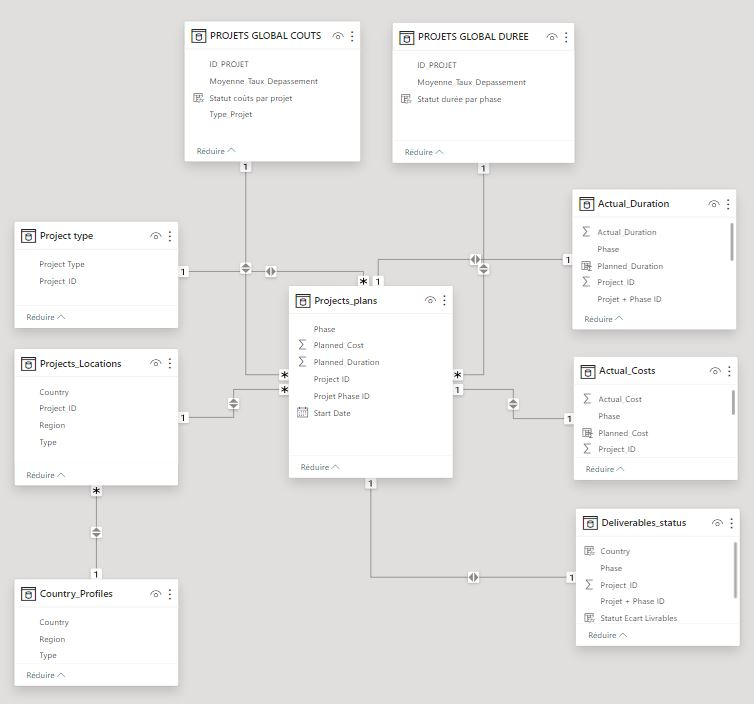

# 📘 Dictionnaire de données des 9 tables

• **Table de faits** = table contenant des valeurs chiffrées pouvant mener à des calculs (ex : ventes, quantités) et les clés permettant de les relier aux tables de dimensions.

• **Table de dimensions** = table contenant des informations descriptives (ex : produits, clients, dates) qu'on utilise pour analyser les faits. Elle change peu et on ne calcule rien avec.

## Table de Faits 1 : `Project_plans`

| Champ                     | Type   | Contrainte   | Description                                                                                                |
|---------------------------|--------|--------------|------------------------------------------------------------------------------------------------------------|
| `Project_ID`              | STRING |              | Identifiant unique pour chaque projet. Il y a plusieurs lignes pour chaque ID projet car plusieurs phases  |
| `Phase`                   | STRING |              | Phase du projet                                                                                            |
| `Start Date`              | DATE   |              | Date de départ d'un projet                                                                                 |
| `Planned_Duration`        | FLOAT  |              | Nombre de jours prévus par phase. Estimation renseignée par l'équipe en charge                             |
| `Planned_Cost`            | FLOAT  |              | Coûts prévus (en $) pour achever la phase de projet associée. Estimation renseignée par l'équipe en charge |

| Champ                     | Type   | Contrainte   | Description                                

## Table de Dimensions 1 : `Project type`

| Champ                     | Type   | Contrainte   | Description                                                                                                |
|---------------------------|--------|--------------|------------------------------------------------------------------------------------------------------------|
| `Project_ID`              | STRING | Clé Primaire | Identifiant unique pour chaque projet.                                                                     |
| `Project Type`            | STRING |              | Type de projet : IT ou Marketing                                                                           |

## Table de Faits 2 : `Actual_Costs`

| Champ                     | Type   | Contrainte   | Description                                                                                               |
|---------------------------|--------|--------------|-----------------------------------------------------------------------------------------------------------|
| `Project_ID`              | STRING |              | Identifiant unique pour chaque projet. Il y a plusieurs lignes pour chaque ID projet car plusieurs phases |
| `Phase`                   | STRING |              | Phase du projet                                                                                           |
| `Actual_Cost              | FLOAT  |              | Coût réel (en $) constaté de la phase du projet. Donnée resneignéee à la fin de la phase                  |

## Table de Faits 3 : `Actual_Duration`

| Champ                     | Type   | Contrainte   | Description                                                                                               |
|---------------------------|--------|--------------|-----------------------------------------------------------------------------------------------------------|
| `Project_ID`              | STRING |              | Identifiant unique pour chaque projet. Il y a plusieurs lignes pour chaque ID projet car plusieurs phases |
| `Phase`                   | STRING |              | Phase du projet                                                                                           |
| `Actual_Duration`         | FLOAT  |              | Nombre de jours nécessaires pour achever la phase du projet. Constaté à la fin de chaque phase            |

## Table de Faits 4 : `Deliverables_status`

| Champ                     | Type   | Contrainte   | Description                                                                                               |
|---------------------------|--------|--------------|-----------------------------------------------------------------------------------------------------------|
| `Project_ID`              | STRING |              | Identifiant unique pour chaque projet. Il y a plusieurs lignes pour chaque ID projet car plusieurs phases |
| `Phase`                   | STRING |              | Phase du projet                                                                                           |
| `Var_Deliverables`        | FLOAT  |              | Différence (en %) entre le nombre cible de livrables et le nombre réel livré pour chaque phase de projet. Donnée renseignée à des fins de suivi de performance. Elle permet de tracer la quantité d'éléments qui auraient dûs être livrés mais qui ne l'ont pas été       |

## Table de Dimensions 2 : `Projects_Locations`

| Champ                     | Type   | Contrainte   | Description                                                                                                |
|---------------------------|--------|--------------|------------------------------------------------------------------------------------------------------------|
| `Project_ID`              | STRING | Clé Primaire | Identifiant unique pour chaque projet.                                                                     |
| `Country`                 | STRING |              | Pays dans lequel le projet est en cours de réalisation                                                     |

## Table de Dimensions 3 : `Country_Profiles`

| Champ                     | Type   | Contrainte   | Description                                                                                                |
|---------------------------|--------|--------------|------------------------------------------------------------------------------------------------------------|
| `Country`                 | STRING | Clé Primaire | Pays dans lequel le projet est en cours de réalisation                                                     |
| `Region`                  | STRING |        | Région du pays (Asie Pacifique, Wester Europe, Central/Eastern Europe-Middle East-Africa, North & Latin America) | 
| `Type`                    | STRING |              | Classification du pays en fonction du type de partenariat (affilié ou distributeur)                        |

## Architecture des données 

